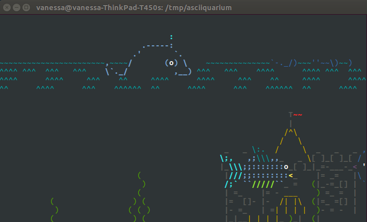

# Asciiquarium Docker

This is the tiniest (and quickest!) Docker container I've ever thrown together. I absolutely had
to have the [asciiquarium](https://opensource.com/article/18/12/linux-toy-asciiquarium)
running on my Ubuntu machine, and of course... Docker to the rescue! Here you go:

```bash
docker run -it vanessa/asciiquarium 
```



and then press "q" to quit. And thank you to the creator of this amazing fish tank! This might be the only kind
of pet that I can't possibly let die. :P
